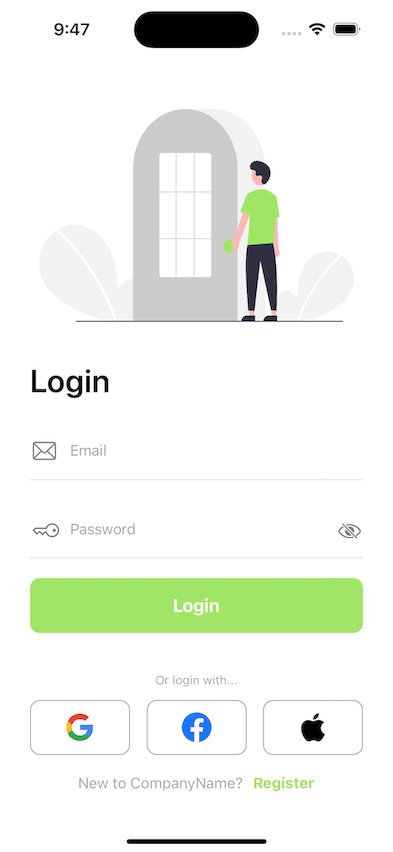
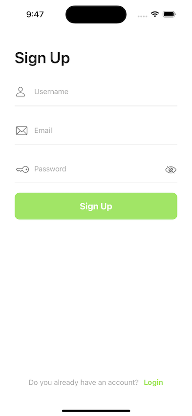
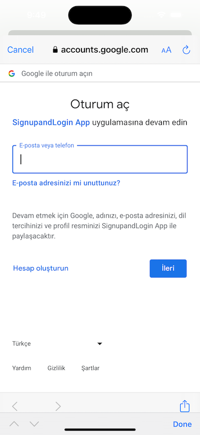
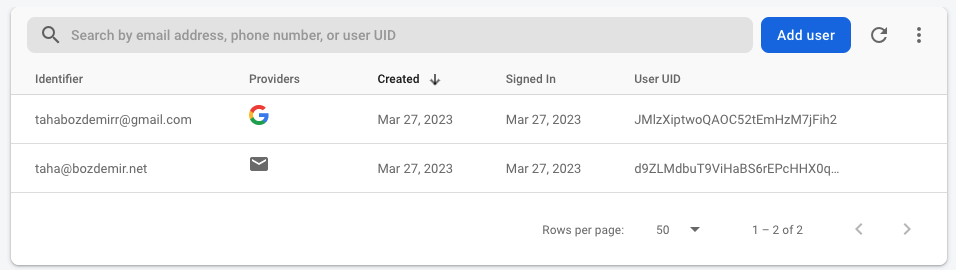
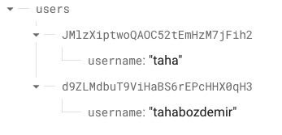
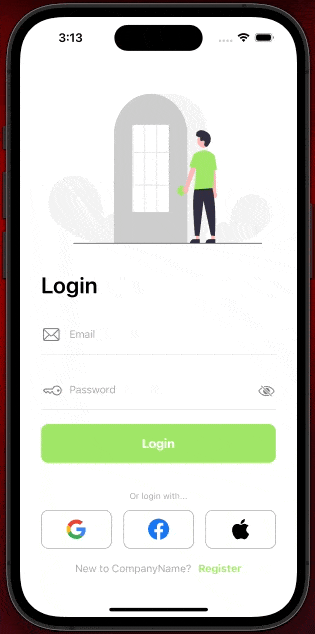
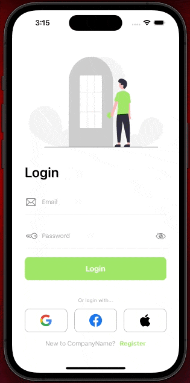

# SignUpandLoginFirebase

SignUpandLoginFirebase is the login interface where you can login and register using Firebase.

## Descriptions

- UIKit

- [SnapKit](https://github.com/SnapKit/SnapKit)

- [Firebase](https://firebase.google.com/) (Realtime Database, Authentication)

- MVVM Design Pattern

- Delegation Pattern

## Requirements

### Firebase Realtime Database Security Rules

```bash
{
  "rules": {
		"users": {
      ".read": true,
      ".write": "(auth!=null)",
      ".indexOn" : ["username"]
    }
  }
}
```

- Make sure you have an internet connection.

## Support Me

Please contact me if you find any bad code, I am eager to learn more.

## Screenshots

### App Screenshots







### Firebase Screenshots




### App Gifs




## License

**SignUpandLoginFirebase** is available under the MIT license. See the LICENSE file for more info.

## Authors

- [@tahabozdemir](https://www.github.com/tahabozdemir)
